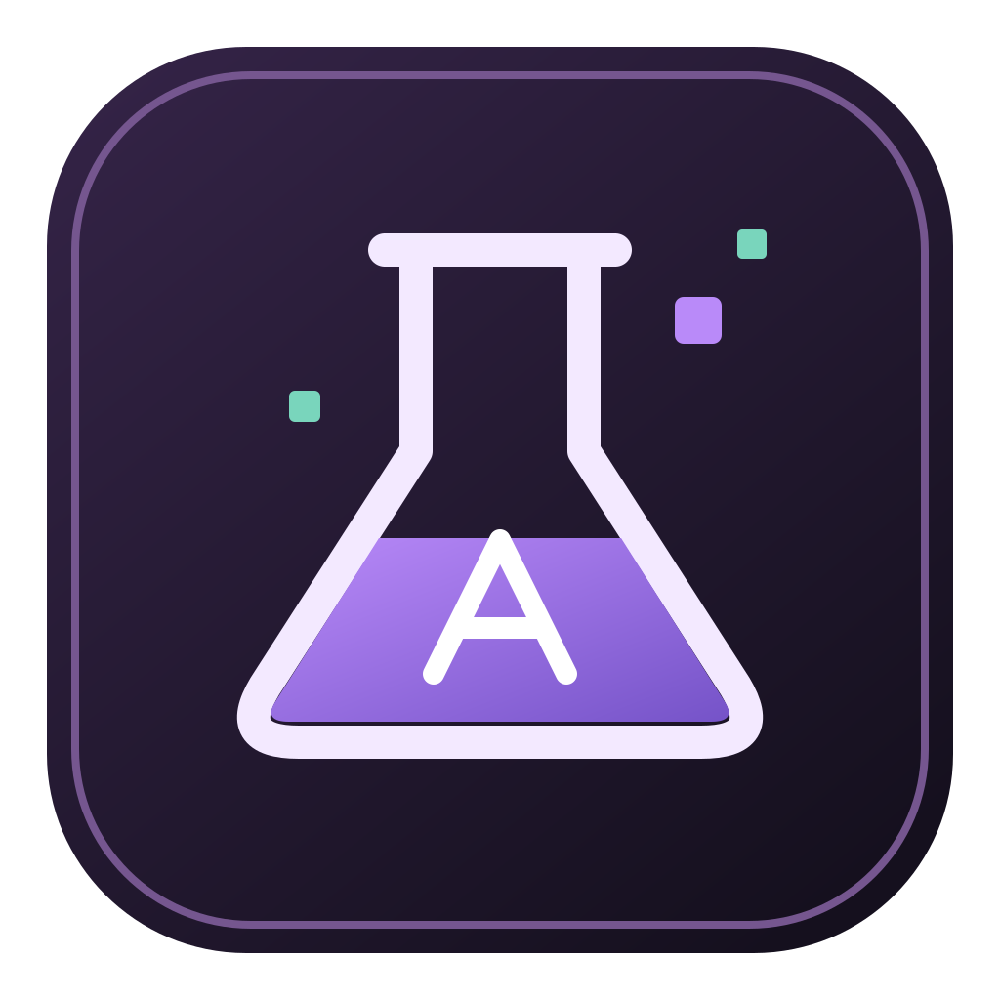
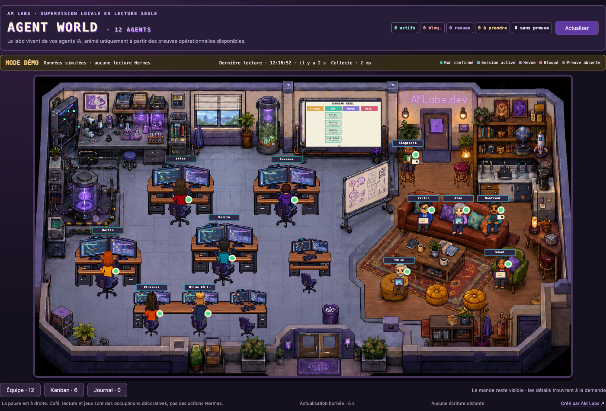

<p align="center">
  
</p>

<h1 align="center">Agent World</h1>

<p align="center">
  Vos agents Hermes, réunis dans un laboratoire pixel-art.<br>
  Voyez qui travaille, attend une décision ou ne donne plus signe d’activité.
</p>

<p align="center">
  <strong>Mac Apple Silicon · Lecture seule · Gratuit et open source</strong>
</p>

<p align="center">
  <a href="docs/INSTALLATION.md">Installation</a> ·
  <a href="#essayer-la-démo">Démo</a> ·
  <a href="docs/VPS.md">Connexion VPS</a> ·
  <a href="#mises-à-jour">Mises à jour</a> ·
  <a href="https://amlabs.dev">AM Labs</a>
</p>



<p align="center"><sub>Capture du mode démo, avec des données simulées. Les animations sont décoratives ; les états reposent sur les preuves d’activité disponibles.</sub></p>

> [!NOTE]
> **Version 0.2.0 — candidat pour développeurs, pas encore publié.**
> Les anciennes archives publiques 0.1.x utilisent un autre modèle d’accès VPS et ne contiennent pas les protections de cette version.

## Un aperçu de votre équipe

Agent World observe une installation Hermes existante et donne une vue d’ensemble de son activité. Le laboratoire reste visible pendant que vous consultez les détails.

- **Les agents** : état, avatar et dernières preuves d’activité dans le panneau Équipe.
- **Le travail en cours** : cartes Kanban, blocages et revues à suivre.
- **La fraîcheur des données** : erreurs de lecture et absence de preuve affichées explicitement.
- **Votre installation** : une source locale sur le Mac, ou un serveur préparé pour la consultation à distance.

L’application observe les agents ; elle ne leur envoie pas d’instructions et n’exécute pas leurs tâches. La scène possède dix places de travail et dix de repos. Les agents supplémentaires restent accessibles dans Équipe.

## Installer et démarrer

Hermes doit déjà être installé pour utiliser une source réelle. Pour découvrir l’interface sans connecter de données, commencez par la [démo](#essayer-la-démo).

| Vos agents tournent… | Préparation |
| --- | --- |
| **Sur votre Mac** | Ouvrir l’app, choisir « Sur ce Mac », détecter Hermes et autoriser la lecture locale. |
| **Sur votre VPS** | Préparer le lecteur sur **Debian 13 ARM64 avec OpenSSH et systemd**, puis utiliser une clé SSH dédiée. [Guide VPS](docs/VPS.md). |

Avec une archive de test 0.2.0 fournie par le mainteneur :

1. [Vérifier les fichiers et leur signature](docs/SIGNATURES.md).
2. Extraire l’archive et placer **Agent World.app** dans **Applications**.
3. Ouvrir l’app, choisir la source et les agents à afficher.

**L’application Mac n’est pas notarisée.** macOS peut bloquer la première ouverture. Le [guide d’installation](docs/INSTALLATION.md) explique l’exception individuelle, sans désactiver Gatekeeper globalement.

Le projet vise les versions récentes de macOS sur Apple Silicon. La version exacte utilisée pour la recette figure dans le [rapport de validation](docs/VALIDATION-0.2.0.md) ; elle ne limite pas l’app à cette seule version. La présence d’un binaire Intel dans l’archive ne constitue pas une annonce de compatibilité Intel.

## Essayer la démo

Depuis les sources, avec Node.js 22 ou plus récent :

```sh
npm ci
npm run dev
```

Ouvrir **http://127.0.0.1:1420/?fixture=1**. La démo ne lit aucune donnée Hermes : elle propose plusieurs états et des scénarios de 10, 40 ou 256 agents, ainsi que des cas vides ou en erreur. Elle est réservée au développement et n’est pas embarquée dans la version distribuée.

## Vos données restent entre vos machines

Pas de compte AM Labs, de télémétrie produit, de rapport de plantage automatique ni de relais cloud.

**En local**, la lecture nécessite une confirmation native et s’effectue dans un processus isolé, sans accès réseau ni écriture dans Hermes. Les noms des agents restent visibles ; les titres sont masqués.

**Sur VPS**, l’administrateur choisit les profils publiés. Un export limité expose des identifiants opaques, avec noms et titres masqués par défaut. La connexion SSH est chiffrée ; le compte de consultation ne dispose ni de shell libre, ni de transfert de fichiers, ni de tunnel. Les alias saisis dans l’app restent sur le Mac.

L’exporteur reste un composant de confiance, car il lit des bases pouvant contenir des données privées. Ces protections ne couvrent pas un système ou un administrateur compromis. [Confidentialité](docs/PRIVACY.md) · [Modèle de sécurité](docs/SECURITY.md) · [Protocole](docs/PROTOCOL.md).

## Mises à jour

**Mises à jour depuis l’app :** une nouvelle release GitHub peut être signalée en bas du laboratoire. Le bouton permet de lire ses notes, puis d’installer le paquet vérifié et de redémarrer après confirmation. La vérification au lancement est désactivable ; aucun programme n’est téléchargé sans votre action.

La première distribution équipée doit embarquer la clé publique définitive et utiliser le canal signé décrit dans [UPDATES.md](docs/UPDATES.md). Les anciens téléchargements et les builds sans clé restent à remplacer manuellement. Les réglages sont conservés séparément de l’application.

Les composants VPS se mettent à jour séparément par l’administrateur, avec sauvegarde et possibilité de retour arrière. Ne pas les remplacer automatiquement avec l’app Mac. [Installation et migration](docs/INSTALLATION.md) · [Maintenance VPS](docs/VPS.md).

Une release publiée avec son manifeste signé déclenche la notification ; un simple commit sur GitHub ne suffit pas. Les données des agents ne sont jamais envoyées à GitHub.

## Développer et contribuer

Pour l’app native : Node.js 22+, Rust 1.98.0, outils Xcode et `sqlite3` pour les tests.

```sh
npm ci
npm run tauri dev
```

Les commandes de vérification sont dans [CONTRIBUTING.md](CONTRIBUTING.md). Pour compiler un paquet local :

```sh
npm run build:beta -- --bundles app
npm run package:beta
```

Un bug ? Joindre la version, le modèle de Mac, macOS et les étapes de reproduction. Utiliser des données fictives ; ne pas partager de clés, de conversations ou de bases Hermes. [Guide de test](docs/TEST-BETA.md). Pour une vulnérabilité, suivre [SECURITY.md](SECURITY.md).

---

Créé par **[AM Labs](https://amlabs.dev)** · Licence **[MIT](LICENSE)** · [Notices des dépendances et droits des visuels](THIRD_PARTY_NOTICES.md)

Destiné aux développeurs utilisant Hermes. Le dépôt public permet à chacun d’étudier, modifier et redistribuer le projet dans les conditions de sa licence.
